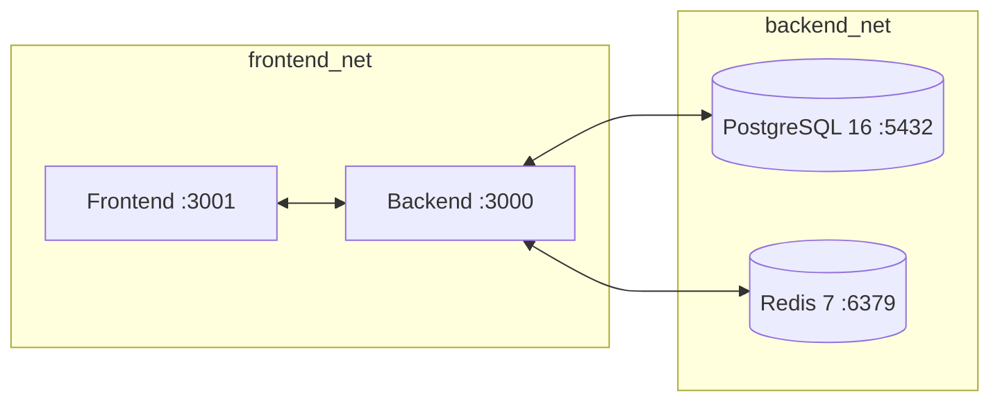

# Khademni Teacher Recruitment Platform

An enterprise SaaS platform for intelligent teacher recruitment featuring **multi-tenant organization isolation**, **in-process explainable AI matching** (384-dimensional dense ONNX vector embeddings + PostgreSQL pgvector + full-text BM25 search with Reciprocal Rank Fusion), **structured multi-criteria interview scheduling with iCalendar support**, and a **Next.js 16 App Router frontend**.

---

## 1. System Architecture & Tech Stack

```text
intelligent-teacher-recruitment-platform/
├── docker-compose.yml               # Production & Dev Compose Orchestration (Segmented Networks)
├── .env.example                     # Central Root Environment Variable Template
├── backend/
│   ├── Dockerfile                   # Multi-Stage Node.js 22 Express Runner (Unprivileged User)
│   ├── docker-compose.yml           # Backend Isolated Stack
│   ├── src/
│   │   ├── app.ts                   # Express v5 Application Stack & Route Mounting
│   │   ├── index.ts                 # HTTP Server Lifecycle & Graceful Shutdown
│   │   ├── config/                  # Strict Zod Environment & OpenAPI Configuration
│   │   ├── lib/                     # Database, Redis, JWT, Argon2, Encryption & Logger
│   │   ├── common/                  # Middlewares (Auth, Tenant, CSRF, Magic-Byte Upload, Rate-Limits)
│   │   └── modules/                 # Admin, AI-Models, Applications, Auth, Interviews, Jobs, Matching, Orgs, Users
│   └── prisma/
│       ├── schema.prisma            # PostgreSQL 16 Schema (23 Models, pgvector, tsvector)
│       ├── seed.ts                  # Database Seeding with Environment-Sourced Passwords
│       └── migrations/              # Automated Database Migrations
└── frontend/
    ├── Dockerfile                   # Multi-Stage Next.js 16 Standalone Runner (Unprivileged User)
    ├── .env.example                 # Frontend Environment Variable Template
    └── src/
        ├── app/                     # Next.js 16 App Router (Public, Auth, Candidate, Admin, Orgs)
        ├── components/              # Reusable UI Primitives & Layout Shells
        ├── features/                # Domain API Query Hooks & Mutations (TanStack React Query v5)
        └── lib/                     # Centralized API Fetch Client with Automatic Refresh Rotation
```

### Core Technology Stack

| Layer | Technologies |
|---|---|
| **Backend API** | Node.js 22 (ESM), Express v5, TypeScript 5, Zod 3, `@asteasolutions/zod-to-openapi` |
| **Database & Search** | PostgreSQL 16, Prisma ORM 7, `pgvector` 384d extension, `tsvector` full-text search |
| **Caching & Queues** | Redis 7 (`ioredis`), `rate-limit-redis`, BullMQ distributed worker queue |
| **AI Semantic Engine** | Local in-process ONNX Runtime (`@xenova/transformers`, `Xenova/all-MiniLM-L6-v2`), Reciprocal Rank Fusion (RRF), Cross-Attention Reranker |
| **Security & Cryptography** | Argon2 password hashing, Jose JWT with atomic transaction rotation, AES-256-GCM column encryption, Double Submit Cookie CSRF with `crypto.timingSafeEqual`, binary magic-byte upload validation (`file-type`), HMAC-SHA256 webhook verification |
| **Frontend Client** | Next.js 16.3 (App Router), TypeScript 5, Tailwind CSS v4, TanStack Query v5, TanStack Table v9, Lucide React, Recharts v3, Sonner |
| **Infrastructure** | Docker Compose with network segmentation (`backend_net`, `frontend_net`), CPU/RAM resource limits, and `no-new-privileges` |

---

## 2. Service Topology & Network Segmentation

Services communicate across two isolated Docker bridge networks:



| Service | Container Name | Base Image / Context | Internal Port | Published Port | Healthcheck Command | Network |
|---|---|---|:---:|:---:|---|---|
| **`postgres`** | `recruitment_postgres` | `postgres:16-alpine` | `5432` | `127.0.0.1:5432` | `pg_isready -U recruitment_user -d recruitment_db` | `backend_net` |
| **`redis`** | `recruitment_redis` | `redis:7-alpine` | `6379` | `127.0.0.1:6379` | `redis-cli -a ${REDIS_PASSWORD} ping` | `backend_net` |
| **`backend`** | `recruitment_backend` | `./backend/Dockerfile` | `3000` | `3000` | `curl -f http://localhost:3000/health` | `backend_net`<br>`frontend_net` |
| **`frontend`** | `recruitment_frontend` | `./frontend/Dockerfile` | `3001` | `5173` | `wget --spider http://localhost:3001/jobs` | `frontend_net` |

---

## 3. User Roles & Capabilities

| Role | Access Level | Capabilities | Primary Route |
|---|---|---|---|
| **Platform Super Admin** | `role: ADMIN`<br>`isSuperAdmin: true` | Manages global AI models, algorithm tuning, hyperparameters, system-wide evaluations/metrics, and cross-tenant organization directory. | `/admin/ai-models`<br>`/admin/dashboard` |
| **Organization Admin** | `role: ADMIN`<br>`organizationId: "<org_id>"` | Manages institution profile, publishes jobs, configures matching rules & keywords, reviews applications, triggers AI matching, schedules interviews, and manages team members. | `/admin/dashboard`<br>`/admin/jobs`<br>`/org/me` |
| **Recruiter / Interviewer** | `role: ADMIN`<br>`organizationId: "<org_id>"` | Conducts assigned interviews, accesses meeting links (Zoom/Meet/Teams), and submits multi-criteria scorecards (`ScorecardCriteriaScore`). | `/admin/interviews` |
| **Candidate** | `role: CANDIDATE`<br>`organizationId: null` | Discovers published job posts, submits applications with CV uploads, tracks progress with tracking codes (`APP-XXXXXXXX`), manages scheduled interviews, and downloads `.ics` calendars. | `/jobs`<br>`/candidate/dashboard` |

---

## 4. End-to-End Recruitment Workflow

```text
1. Organization Setup  -> Admin onboards school / institution profile at /org/me.
2. Job Post & Rules    -> Admin creates job post, adds weighted keywords (REQUIRED/OPTIONAL/BONUS)
                          and matching rules (DEGREE/EXPERIENCE/CERTIFICATION), then publishes.
                          Background ONNX embedder generates 384d vector for job_posts.embedding.
3. Candidate Ingestion -> Candidate browses /jobs and applies with CV (PDF/DOCX/PNG/JPEG).
                          Upload middleware validates binary magic bytes in memory via file-type.
                          Document parser extracts text via pdf-parse, computes 384d embedding,
                          and indexes into candidate_hybrid_indexes with tenant partition columns.
4. AI Matching Engine  -> Recruiter triggers synchronous match or enqueues async BullMQ batch run.
                          Engine evaluates pgvector cosine distance + BM25 tsvector Reciprocal
                          Rank Fusion (RRF) + degree hierarchy regex + experience date merging
                          + Cross-Attention reranking, generating a final match score (0-100%).
5. Shortlist & Review  -> Recruiter reviews leaderboard at /admin/matching, views score breakdown,
                          and advances candidate to SHORTLISTED.
6. Interview & ICS     -> Recruiter schedules interview (Screening, Technical, Pedagogical Demo,
                          Behavioral, Final HR) with meeting provider link and assigns panel.
                          System generates RFC 5545 iCalendar (.ics) and dispatches Brevo email.
7. Scorecard & Hire    -> Interviewers submit criteria ratings and recommendations (STRONG_HIRE,
                          HIRE, NEUTRAL, NO_HIRE, STRONG_NO_HIRE). Application advances to ACCEPTED.
```

---

## 5. Environment Variables & Configuration

Configuration is validated at startup via Zod (`backend/src/config/env.ts`). When `NODE_ENV === "production"`, strict validation rejects default keys and requires complete SMTP, encryption, and webhook configuration.

| Variable | Description | Production Requirement |
|---|---|---|
| `NODE_ENV` | Environment mode (`development`, `production`, `test`) | Required (`production`) |
| `PORT` | Backend HTTP port (default `3000`) | Optional |
| `DATABASE_URL` | PostgreSQL connection string | Required (No default) |
| `JWT_ACCESS_SECRET` | Secret key for signing 15-minute Access JWTs | Min 32 characters |
| `JWT_REFRESH_SECRET` | Secret key for signing 7-day Refresh JWTs | Min 32 characters |
| `CSRF_SECRET` | Secret key for Double Submit Cookie CSRF | Min 32 characters |
| `DATABASE_ENCRYPTION_KEY` | AES-256-GCM column encryption key for MFA secrets | 64 hex characters (32 bytes) |
| `BREVO_WEBHOOK_SECRET` | HMAC-SHA256 secret for Brevo email webhook validation | Min 16 characters |
| `REDIS_URL` | Redis connection URL (e.g. `redis://recruitment_redis:6379`) | Required for BullMQ queue |
| `REDIS_PASSWORD` | Redis authentication password (`--requirepass`) | Min 16 characters |
| `TRUST_PROXY` | Express trust proxy configuration (default `loopback`) | Recommended `loopback` |
| `SMTP_HOST` | Brevo SMTP host (`smtp-relay.brevo.com`) | Required in production |
| `SMTP_PORT` | SMTP port (`587`) | Required in production |
| `SMTP_USER` | SMTP username / login email | Required in production |
| `SMTP_PASS` | SMTP API / relay password | Required in production |
| `NEXT_PUBLIC_API_URL` | Frontend client target REST API endpoint | Required in frontend build |

---

## 6. Quick Start & Execution Guide

### Option 1: Full Platform via Docker Compose (Recommended)

```powershell
# 1. From the project root, build and start all containers
docker compose up --build -d

# 2. Run database migrations and seed default platform accounts
docker compose exec backend npm run db:seed

# 3. Check service health
docker compose ps

# 4. View real-time logs
docker compose logs -f
```

### Option 2: Local Development (Step-by-Step)

#### Terminal 1 — Backend & Database:
```powershell
cd backend
npm install
npx prisma generate
npx prisma db push
npm run db:seed
npm run dev
```
> Backend runs at `http://localhost:3000` (Swagger UI at `http://localhost:3000/docs`).

#### Terminal 2 — Frontend:
```powershell
cd frontend
npm install
npm run dev
```
> Frontend runs at `http://localhost:3001` (or `http://localhost:5173`).

---

## 7. Default Seed Credentials

| Role | Email | Password | Access |
|---|---|---|---|
| **Super Admin / Org Admin** | `admin@khademni.local` | `DevAdminSecret_2026!` | Full Admin & AI Management (`/admin/dashboard`) |
| **Candidate** | `candidate@khademni.local` | `DevCandidateSecret_2026!` | Candidate Portal & Job Applications (`/jobs`) |

---

## 8. Verification & Testing Commands

```powershell
# Run backend unit tests, security assertions, and integration tests
cd backend
npm test

# Verify backend TypeScript compilation
npm run build

# Validate Docker Compose configuration
cd ..
docker compose config
```
