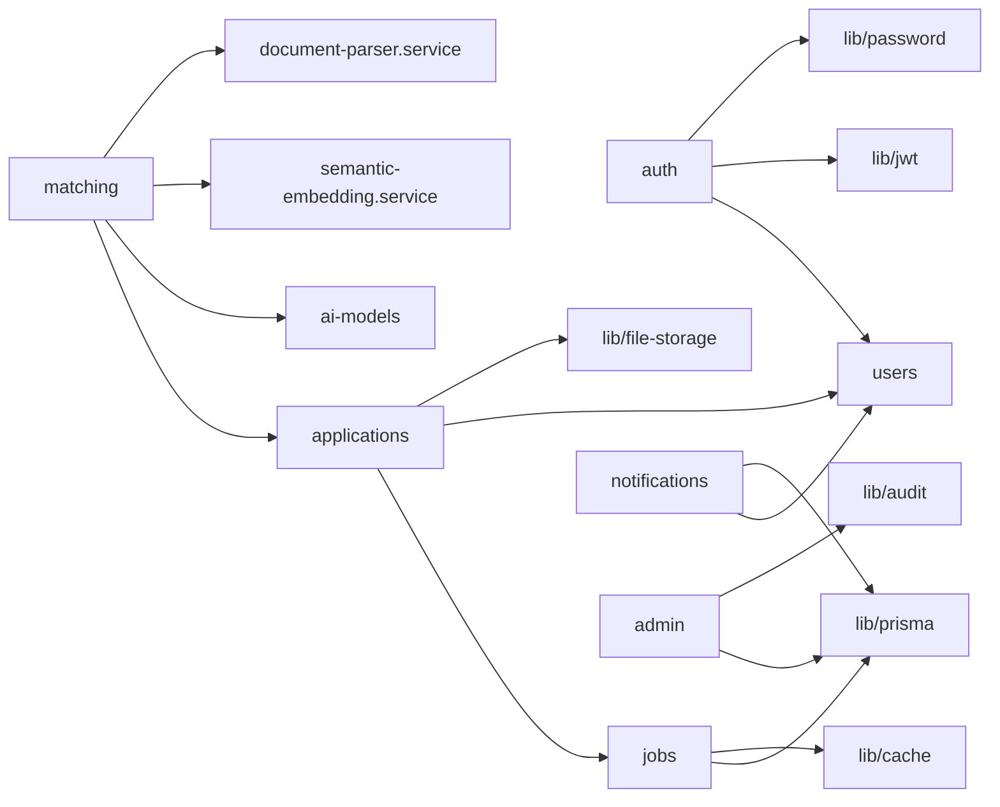
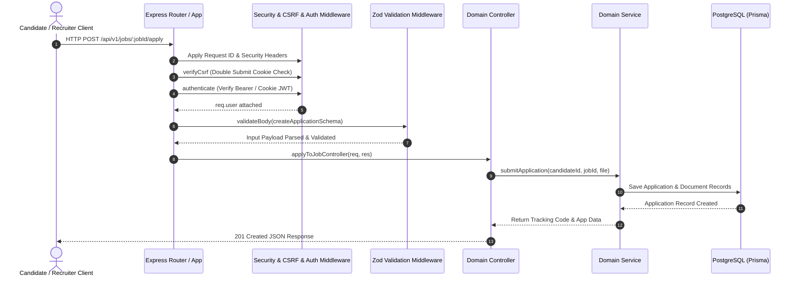
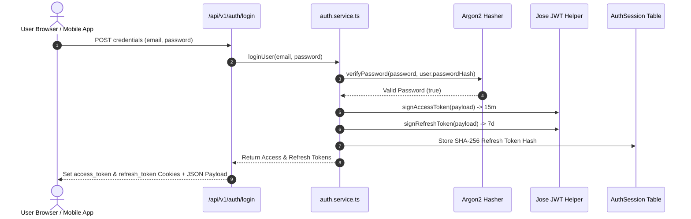
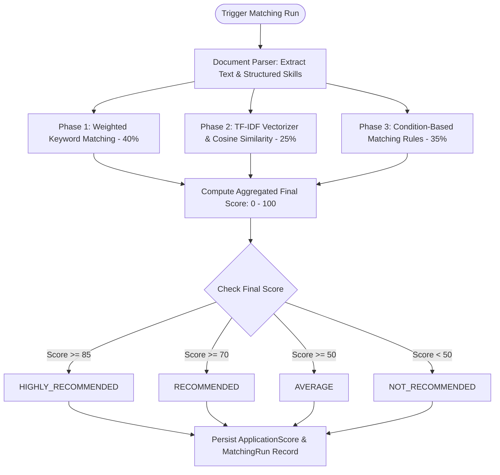
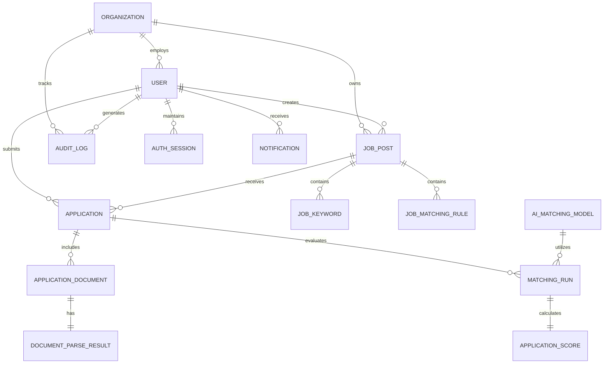

# Sub-Agent 14 — Technical Documentation & Architecture Manual

**Target System**: Intelligent Teacher Recruitment Platform (Backend)  
**Analysis Date**: August 2026  
**Scope**: Complete System Architecture Manual, Execution Lifecycle, Module Dependencies, Data Flow Pipelines, and Architectural Visualizations (Mermaid Diagrams).

---

## 1. System Architecture Overview

The **Intelligent Teacher Recruitment Platform** backend is an enterprise Node.js/TypeScript application designed for automated candidate screening, candidate-job matching, and recruitment management. It features an offline hybrid AI engine combining TF-IDF vector space modeling, custom rule evaluation, and weighted keyword extraction.

---

## 2. Mermaid Visualizations

### 1. Project Directory Topology Diagram

```mermaid
graph TD
    Root["backend/"] --> Src["src/"]
    Root --> Prisma["prisma/"]
    Root --> Scripts["scripts/"]
    
    Src --> App["app.ts (Express Setup)"]
    Src --> Index["index.ts (Server Bootstrap)"]
    Src --> Common["common/"]
    Src --> Config["config/"]
    Src --> Lib["lib/"]
    Src --> Modules["modules/"]
    
    Common --> Middlewares["middlewares/ (Auth, CSRF, RateLimit, Tenant, Error)"]
    Common --> Validators["validators/ (Zod Schemas)"]
    Common --> Errors["errors/ (AppError)"]
    Common --> Utils["utils/ (asyncHandler)"]
    
    Lib --> JWT["jwt.ts"]
    Lib --> Password["password.ts (Argon2)"]
    Lib --> Storage["file-storage.ts"]
    Lib --> PrismaLib["prisma.ts (Client Singleton)"]
    Lib --> EmailLib["email.ts"]
    Lib --> AuditLib["audit.ts"]
    
    Modules --> AdminMod["admin/"]
    Modules --> AIMod["ai-models/"]
    Modules --> AppsMod["applications/"]
    Modules --> AuthMod["auth/"]
    Modules --> JobsMod["jobs/"]
    Modules --> MatchMod["matching/"]
    Modules --> NotifMod["notifications/"]
    Modules --> UsersMod["users/"]
```

---

### 2. Module Dependency Graph

---

### 3. Comprehensive Request Lifecycle Sequence Diagram

---

### 4. Authentication & JWT Session Flow

---

### 5. AI Candidate Matching & Scoring Pipeline

---

### 6. Database Entity-Relationship Diagram (ERD)

---

## 3. Data Flow & Processing Lifecycle Summary

1. **Recruitment Configuration**: Recruiter creates a `JobPost`, attaches required/optional `JobKeyword` entries, and specifies `JobMatchingRule` conditions.
2. **Candidate Application**: Candidate submits an `Application` along with a CV file. The system parses text content via `document-parser.service.ts` and saves raw text to `DocumentParseResult`.
3. **AI Screening Execution**: Matching runs process candidate CV text against job requirements, calculating a 3-part composite score (Keywords 40%, Rules 35%, Cosine Similarity 25%).
4. **Ranking & Notification**: The final score and recommendation tier are saved to `ApplicationScore`, and a notification is dispatched to the candidate and recruiting manager.
