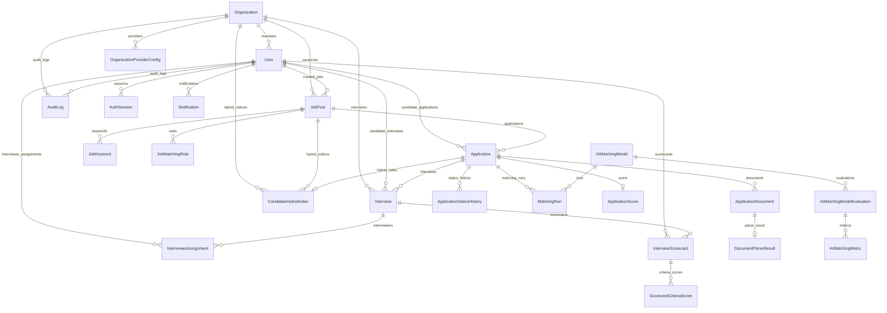
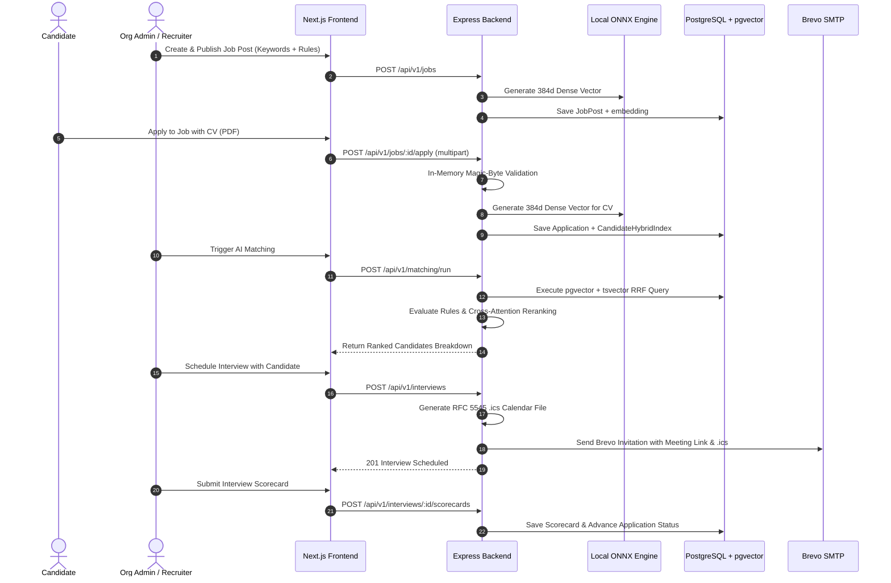

# Sub-Agent 14 — Technical Documentation & Architecture Manual

**Target System**: Intelligent Teacher Recruitment Platform (Backend)  
**Analysis Date**: August 2026  
**Status**: Verified & Synchronized with Current Codebase  
**Scope**: Complete System Architecture Manual, Execution Lifecycle, Module Dependencies, Data Flow Pipelines, and Architectural Visualizations (Mermaid Diagrams).

---

## 1. System Architecture Overview

The **Intelligent Teacher Recruitment Platform** backend is an enterprise Node.js 22 / TypeScript application designed for automated candidate screening, explainable hybrid vector AI matching, and multi-tenant recruitment management. It features an in-process AI engine combining local ONNX transformer embeddings (`Xenova/all-MiniLM-L6-v2`), PostgreSQL `pgvector`, `tsvector` full-text search with Reciprocal Rank Fusion (RRF), Cross-Attention reranking, and structured interview scheduling with iCalendar support.

---

## 2. Mermaid Visualizations

### 1. Project Directory Topology Diagram

```mermaid
graph TD
    Root["backend/"] --> Src["src/"]
    Root --> Prisma["prisma/"]
    Root --> Scripts["scripts/"]
    
    Src --> App["app.ts (Express Setup)"]
    Src --> Index["index.ts (Server Bootstrap)"]
    Src --> Common["common/"]
    Src --> Config["config/"]
    Src --> Lib["lib/"]
    Src --> Modules["modules/"]
    
    Common --> Middlewares["middlewares/ (Auth, CSRF, RateLimit, Tenant, Magic-Byte Upload, Error)"]
    Common --> Validators["validators/ (Zod Schemas)"]
    Common --> Errors["errors/ (AppError)"]
    Common --> Utils["utils/ (asyncHandler)"]
    
    Lib --> JWT["jwt.ts"]
    Lib --> Password["password.ts (Argon2)"]
    Lib --> Encryption["encryption.ts (AES-256-GCM)"]
    Lib --> RedisLib["redis.ts (ioredis)"]
    Lib --> Storage["file-storage.ts"]
    Lib --> PrismaLib["prisma.ts (Client Singleton)"]
    Lib --> EmailLib["email.ts (Brevo SMTP)"]
    Lib --> AuditLib["audit.ts"]
    
    Modules --> AdminMod["admin/"]
    Modules --> AIMod["ai-models/"]
    Modules --> AppsMod["applications/"]
    Modules --> AuthMod["auth/"]
    Modules --> InterviewsMod["interviews/"]
    Modules --> JobsMod["jobs/"]
    Modules --> MatchMod["matching/"]
    Modules --> NotifMod["notifications/"]
    Modules --> OrgsMod["organizations/"]
    Modules --> UsersMod["users/"]
```

---

### 2. Complete Database Entity Relationship Diagram (23 Models)

---

### 3. End-to-End Real-Life Recruitment Workflow Sequence

